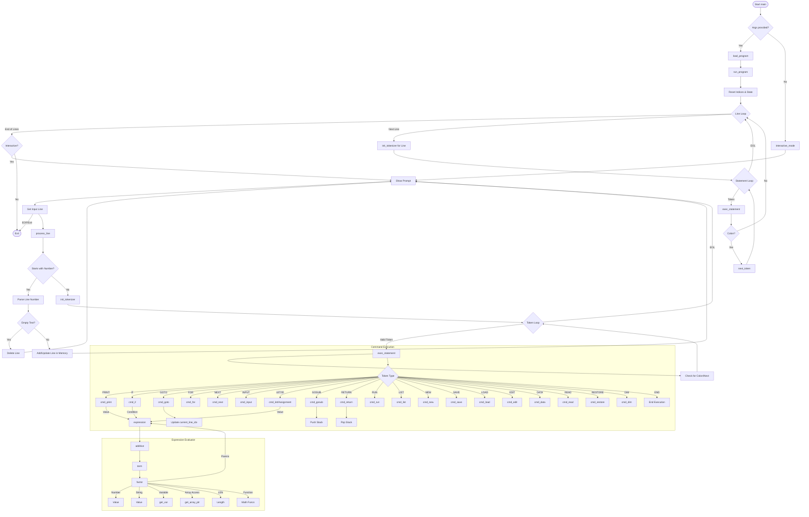

# BASIC Interpreter Flowchart

```mermaid
graph TD
    %% Main Entry Point
    start([Start main]) --> check_args{Args provided?}
    
    check_args -- Yes --> load_file[load_program]
    load_file --> run_prog_entry[run_program]
    
    check_args -- No --> interactive[interactive_mode]
    
    %% Interactive Loop
    interactive --> prompt[Show Prompt]
    prompt --> get_input[Get Input Line]
    get_input -- EOF/Exit --> exit([Exit])
    get_input --> process[process_line]
    
    %% Line Processing
    process --> is_numbered{Starts with Number?}
    
    is_numbered -- Yes --> parse_num[Parse Line Number]
    parse_num --> empty_text{Empty Text?}
    empty_text -- Yes --> delete_line[Delete Line]
    empty_text -- No --> update_line[Add/Update Line in Memory]
    delete_line --> prompt
    update_line --> prompt
    
    is_numbered -- No --> init_tok[init_tokenizer]
    init_tok --> immediate_loop{Token Loop}
    
    immediate_loop -- EOL --> prompt
    immediate_loop -- Valid Token --> exec_stmt[exec_statement]
    exec_stmt --> next_tok_check[Check for Colon/Next]
    next_tok_check --> immediate_loop
    
    %% Run Program Loop
    run_prog_entry --> reset_state[Reset Indices & State]
    reset_state --> prog_loop{Line Loop}
    
    prog_loop -- End of Lines --> interactive_or_exit{Interactive?}
    interactive_or_exit -- Yes --> prompt
    interactive_or_exit -- No --> exit
    
    prog_loop -- Next Line --> tokenize_line[init_tokenizer for Line]
    tokenize_line --> stmt_loop{Statement Loop}
    
    stmt_loop -- EOL --> prog_loop
    stmt_loop -- Token --> exec_stmt_run[exec_statement]
    exec_stmt_run --> check_colon{Colon?}
    check_colon -- Yes --> next_token
    next_token --> stmt_loop
    check_colon -- No --> prog_loop

    %% Execution Dispatch
    subgraph ExecutionLogic [Command Execution]
        direction TB
        exec_stmt --> dispatch{Token Type}
        
        dispatch -- PRINT --> cmd_print[cmd_print]
        dispatch -- IF --> cmd_if[cmd_if]
        dispatch -- GOTO --> cmd_goto[cmd_goto]
        dispatch -- FOR --> cmd_for[cmd_for]
        dispatch -- NEXT --> cmd_next[cmd_next]
        dispatch -- INPUT --> cmd_input[cmd_input]
        dispatch -- LET/ID --> cmd_let[cmd_let/Assignment]
        dispatch -- GOSUB --> cmd_gosub[cmd_gosub]
        dispatch -- RETURN --> cmd_return[cmd_return]
        dispatch -- RUN --> cmd_run[cmd_run]
        dispatch -- LIST --> cmd_list[cmd_list]
        dispatch -- NEW --> cmd_new[cmd_new]
        dispatch -- SAVE --> cmd_save[cmd_save]
        dispatch -- LOAD --> cmd_load[cmd_load]
        dispatch -- EDIT --> cmd_edit[cmd_edit]
        dispatch -- DATA --> cmd_data[cmd_data]
        dispatch -- READ --> cmd_read[cmd_read]
        dispatch -- RESTORE --> cmd_restore[cmd_restore]
        dispatch -- DIM --> cmd_dim[cmd_dim]
        dispatch -- END --> cmd_end[End Execution]
        
        cmd_if -- Condition --> expr[expression]
        cmd_let -- Value --> expr
        cmd_print -- Value --> expr
        
        cmd_goto --> change_pc[Update current_line_idx]
        cmd_gosub --> push_stack[Push Stack]
        cmd_return --> pop_stack[Pop Stack]
    end

    %% Expression Evaluation
    subgraph ExpressionEval [Expression Evaluator]
        expr --> additive
        additive --> term
        term --> factor
        
        factor -- Number --> val_num[Value]
        factor -- String --> val_str[Value]
        factor -- Variable --> get_var[get_var]
        factor -- Array Access --> get_array[get_array_ptr]
        factor -- LEN --> len_func[Length]
        factor -- Function --> math_func[Math Funcs]
        factor -- Parens --> expr
    end
```
